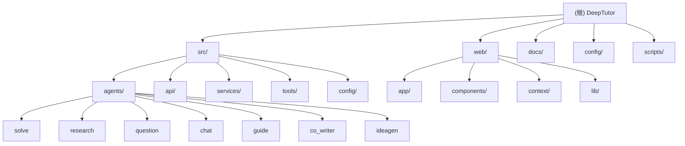

# DeepTutor - AI 驱动的个性化学习助手平台

> 最后更新：2026-03-17 11:33:36

## 变更记录 (Changelog)

### 2026-03-17
- 初始化 AI 上下文文档
- 生成根级与模块级架构文档
- 建立模块索引与导航结构

---

## 项目愿景

DeepTutor 是一个基于多智能体协作与 RAG 技术的智能学习伴侣系统，旨在为学习者提供：
- 海量文档知识问答（RAG + 多智能体问题求解）
- 交互式学习可视化（知识简化、个性化问答、引导式学习）
- 知识强化练习（智能题目生成、考试模拟）
- 深度研究与创意生成（文献综述、知识图谱探索、研究方向发现）

**核心特性**：
- 前后端分离架构（Python FastAPI + React 19 + Next.js 16）
- 多智能体协作（双循环求解、动态主题队列、模块化 Agent）
- 统一 LLM 服务（支持 OpenAI、Anthropic、DashScope 等多提供商）
- RAG 管道选择（Naive、Hybrid、Docling 等多种解析器）
- 实时流式交互（WebSocket + 进度广播）
- 会话持久化（JSON 存储、断点续跑）

---

## 架构总览

### 技术栈

**后端**：
- 语言：Python 3.10+
- 框架：FastAPI 0.100+
- 异步：asyncio + nest_asyncio
- LLM：OpenAI SDK、Anthropic SDK、DashScope SDK
- RAG：raganything、docling、LlamaIndex
- 工具：Web Search (Jina/Perplexity)、Code Execution (沙箱)

**前端**：
- 框架：Next.js 16 (App Router + Turbopack)
- 运行时：React 19
- 语言：TypeScript 5
- 样式：Tailwind CSS 3.4
- UI：Lucide React、Framer Motion 12
- Markdown：react-markdown + KaTeX
- 国际化：i18next + react-i18next

**文档系统**：
- VitePress 1.6

**部署**：
- Docker + Docker Compose
- GitHub Actions CI/CD

### 系统架构图

```
┌─────────────────────────────────────────────────────────────┐
│                      用户界面 (Web)                          │
│  Next.js 16 + React 19 + TailwindCSS + WebSocket           │
└────────────────────┬────────────────────────────────────────┘
                     │ HTTP/WebSocket
┌────────────────────┴────────────────────────────────────────┐
│                   API 层 (FastAPI)                          │
│  REST API + WebSocket + 静态文件服务 + CORS                │
└────────────────────┬────────────────────────────────────────┘
                     │
        ┌────────────┼────────────┐
        │            │            │
┌───────┴──────┐ ┌──┴──────┐ ┌──┴──────────┐
│  Agents 层   │ │ Tools   │ │ Services    │
│  多智能体    │ │ RAG/Web │ │ LLM/Embed   │
│  协作系统    │ │ Code    │ │ Config/Log  │
└──────────────┘ └─────────┘ └─────────────┘
        │
┌───────┴──────────────────────────────────────┐
│  数据层                                       │
│  - Knowledge Bases (向量数据库)              │
│  - User Data (会话、笔记本、历史)            │
│  - Config (YAML 配置文件)                    │
└───────────────────────────────────────────────┘
```

---

## 模块结构图



---

## 模块索引

| 模块路径 | 职责 | 语言 | 入口文件 | 文档 |
|---------|------|------|---------|------|
| `src/agents/solve` | 双循环问题求解系统 | Python | `main_solver.py` | [CLAUDE.md](./src/agents/solve/CLAUDE.md) |
| `src/agents/research` | 深度研究系统 (DR-in-KG) | Python | `research_pipeline.py` | [CLAUDE.md](./src/agents/research/CLAUDE.md) |
| `src/agents/question` | 智能题目生成系统 | Python | `coordinator.py` | [CLAUDE.md](./src/agents/question/CLAUDE.md) |
| `src/agents/chat` | 多轮对话系统 | Python | `chat_agent.py` | [CLAUDE.md](./src/agents/chat/CLAUDE.md) |
| `src/agents/guide` | 引导式学习系统 | Python | `guide_manager.py` | [CLAUDE.md](./src/agents/guide/CLAUDE.md) |
| `src/agents/co_writer` | AI 文本编辑与旁白 | Python | `edit_agent.py` | [CLAUDE.md](./src/agents/co_writer/CLAUDE.md) |
| `src/agents/ideagen` | 研究创意生成系统 | Python | `idea_generation_workflow.py` | [CLAUDE.md](./src/agents/ideagen/CLAUDE.md) |
| `src/api` | FastAPI 后端服务 | Python | `main.py` | [CLAUDE.md](./src/api/CLAUDE.md) |
| `web` | Next.js 前端应用 | TypeScript | `app/layout.tsx` | [CLAUDE.md](./web/CLAUDE.md) |
| `docs` | VitePress 文档站点 | Markdown | `.vitepress/config.mts` | - |
| `config` | 配置文件目录 | YAML | `main.yaml` | - |
| `scripts` | 启动与工具脚本 | Python | `start.py` | - |

---

## 运行与开发

### 环境要求

- Python 3.10+
- Node.js 18+
- 支持的 LLM 提供商 API Key（OpenAI/Anthropic/DashScope 等）

### 快速启动

**1. 安装依赖**
```bash
# 后端
pip install -r requirements.txt

# 前端
cd web && npm install

# 文档
cd docs && npm install
```

**2. 配置环境变量**
```bash
# 复制示例配置
cp .env.example .env

# 编辑 .env 填入 API Keys
# LLM_API_KEY=your_key
# LLM_HOST=https://api.openai.com/v1
# LLM_MODEL=gpt-4o
```

**3. 启动服务**
```bash
# 方式 1：使用启动脚本（推荐）
python scripts/start_web.py

# 方式 2：分别启动
# 后端
python src/api/run_server.py
# 前端
cd web && npm run dev
```

**4. 访问应用**
- 前端：http://localhost:3782
- 后端 API：http://localhost:8001
- API 文档：http://localhost:8001/docs

### Docker 部署

```bash
# 开发环境
docker-compose -f docker-compose.dev.yml up

# 生产环境
docker-compose up -d
```

### 开发工作流

**后端开发**：
```bash
# 代码格式化
ruff format src/

# 代码检查
ruff check src/

# 运行测试
pytest tests/
```

**前端开发**：
```bash
cd web

# 开发服务器（使用 Turbopack）
npm run dev

# 类型检查
npm run lint

# 构建
npm run build
```

---

## 测试策略

### 后端测试

**测试框架**：pytest

**测试目录**：`tests/`
- `tests/agents/` - Agent 单元测试
- `tests/services/` - 服务集成测试
- `tests/core/` - 核心功能测试

**运行测试**：
```bash
pytest tests/ -v
```

**覆盖率**：
```bash
pytest --cov=src tests/
```

### 前端测试

**测试框架**：Playwright

**测试目录**：`web/tests/`
- `web/tests/e2e/` - 端到端测试

**运行测试**：
```bash
cd web
npm run audit        # 运行 UI 审计测试
npm run audit:ui     # 交互式 UI 模式
```

### 质量工具

**Python**：
- Linter：Ruff
- Formatter：Black / Ruff Format
- Type Checker：MyPy（宽松模式）
- Security：Bandit

**TypeScript**：
- Linter：ESLint
- Formatter：Prettier
- Type Checker：TypeScript Compiler

---

## 编码规范

### Python 规范

**风格指南**：
- 遵循 PEP 8
- 行长度：100 字符
- 使用 Type Hints（渐进式采用）
- Docstring：Google 风格

**命名约定**：
- 模块/包：`snake_case`
- 类：`PascalCase`
- 函数/变量：`snake_case`
- 常量：`UPPER_SNAKE_CASE`

**导入顺序**：
1. 标准库
2. 第三方库
3. 本地模块

**示例**：
```python
from typing import Optional, Dict, Any
import asyncio

from fastapi import FastAPI
from pydantic import BaseModel

from src.agents.base_agent import BaseAgent
from src.logging import get_logger

logger = get_logger(__name__)

class MyAgent(BaseAgent):
    """Agent 描述。

    Args:
        config: 配置字典
        api_key: API 密钥
    """

    async def process(self, input_data: str) -> Dict[str, Any]:
        """处理输入数据。

        Args:
            input_data: 输入字符串

        Returns:
            处理结果字典
        """
        result = await self.call_llm(input_data)
        return {"output": result}
```

### TypeScript 规范

**风格指南**：
- 遵循 Airbnb Style Guide
- 使用 TypeScript 严格模式
- 优先使用函数组件 + Hooks

**命名约定**：
- 组件：`PascalCase`
- 函数/变量：`camelCase`
- 常量：`UPPER_SNAKE_CASE`
- 类型/接口：`PascalCase`

**示例**：
```typescript
import { useState, useEffect } from "react";
import type { FC } from "react";

interface MyComponentProps {
  title: string;
  onSubmit: (data: string) => void;
}

export const MyComponent: FC<MyComponentProps> = ({ title, onSubmit }) => {
  const [value, setValue] = useState("");

  useEffect(() => {
    // 副作用逻辑
  }, []);

  return (
    <div className="container">
      <h1>{title}</h1>
      <input value={value} onChange={(e) => setValue(e.target.value)} />
      <button onClick={() => onSubmit(value)}>提交</button>
    </div>
  );
};
```

---

## AI 使用指引

### 项目结构理解

**核心概念**：
1. **Agent**：独立的智能体，继承自 `BaseAgent`，负责特定任务
2. **Tool**：可被 Agent 调用的工具（RAG、Web Search、Code Execution 等）
3. **Service**：底层服务（LLM、Embedding、Config、Logging）
4. **Router**：FastAPI 路由模块，暴露 REST/WebSocket 端点
5. **Context**：React Context，管理前端全局状态

**模块依赖关系**：
```
Agents → Tools → Services
  ↓
API Routers → Agents
  ↓
Web Frontend → API Routers
```

### 常见任务

**添加新 Agent**：
1. 在 `src/agents/{module}/` 创建 Agent 类，继承 `BaseAgent`
2. 在 `prompts/en/` 和 `prompts/zh/` 添加 Prompt YAML
3. 在 `src/api/routers/` 创建对应路由
4. 在前端 `web/app/` 添加页面
5. 更新配置文件 `config/main.yaml` 和 `config/agents.yaml`

**添加新 Tool**：
1. 在 `src/tools/` 创建 Tool 类
2. 在 Agent 中注册 Tool
3. 更新 `config/main.yaml` 中的 `tools` 配置

**添加新 API 端点**：
1. 在 `src/api/routers/` 创建或更新路由文件
2. 在 `src/api/main.py` 中注册路由
3. 在前端 `web/lib/api.ts` 添加 API 调用函数

**添加新前端页面**：
1. 在 `web/app/` 创建页面目录和 `page.tsx`
2. 在 `web/components/Sidebar.tsx` 添加导航链接
3. 创建必要的 Context 和 Hooks

### 调试技巧

**后端调试**：
```python
# 启用详细日志
import logging
logging.basicConfig(level=logging.DEBUG)

# 查看 Agent 统计
from src.agents.solve import MainSolver
solver = MainSolver(...)
# 统计信息会自动打印
```

**前端调试**：
```typescript
// 查看 WebSocket 消息
ws.onmessage = (event) => {
  console.log("WS Message:", JSON.parse(event.data));
};

// 查看 API 响应
const response = await fetch(url);
console.log("API Response:", await response.json());
```

**配置调试**：
```bash
# 验证配置文件
python -c "from src.config import load_config; print(load_config())"

# 检查环境变量
python -c "import os; print(os.getenv('LLM_API_KEY'))"
```

### 最佳实践

1. **使用统一的 BaseAgent**：所有 Agent 应继承 `src/agents/base_agent.py`
2. **Prompt 外部化**：将 Prompt 存储在 YAML 文件中，支持多语言
3. **配置驱动**：通过 `config/main.yaml` 和 `config/agents.yaml` 控制行为
4. **异步优先**：使用 `async/await` 处理 I/O 操作
5. **错误处理**：使用 try-except 捕获异常，记录日志
6. **类型注解**：使用 Type Hints 提高代码可读性
7. **测试覆盖**：为关键功能编写单元测试
8. **文档同步**：更新代码时同步更新 README 和 CLAUDE.md

---

## gstack 集成

本项目集成了 gstack 工具套件，用于浏览器自动化、QA 测试、代码审查和发布流程。

### 浏览器交互规则

**重要**：所有浏览器交互必须使用 `/browse` 技能，**绝不使用** `mcp__claude-in-chrome__*` 工具。

### 可用技能

- `/browse` - 快速无头浏览器，用于 QA 测试和站点验证
- `/qa` - 系统化 QA 测试并修复发现的问题
- `/qa-only` - 仅报告问题的 QA 测试（不修复）
- `/qa-design-review` - 设计审查 + 修复循环
- `/plan-design-review` - 仅报告的设计审查
- `/plan-ceo-review` - CEO/创始人模式计划审查
- `/plan-eng-review` - 工程经理模式计划审查
- `/review` - 落地前 PR 审查
- `/ship` - 发布工作流（合并、测试、版本、变更日志、PR）
- `/setup-browser-cookies` - 从真实浏览器导入 cookies
- `/retro` - 每周工程回顾
- `/document-release` - 发布后文档更新

### 故障排除

如果 gstack 技能无法工作，运行以下命令重新构建二进制文件并注册技能：

```bash
cd .claude/skills/gstack && ./setup
```

**注意**：setup 脚本需要 [bun](https://bun.sh) 运行时。如果未安装，请先安装：

```bash
# macOS/Linux
curl -fsSL https://bun.sh/install | bash

# 或使用 npm
npm install -g bun
```

---

## 常见问题 (FAQ)

**Q: 如何切换 LLM 提供商？**

A: 编辑 `.env` 文件：
```bash
# OpenAI
LLM_API_KEY=sk-...
LLM_HOST=https://api.openai.com/v1
LLM_MODEL=gpt-4o

# Anthropic
LLM_API_KEY=sk-ant-...
LLM_HOST=https://api.anthropic.com
LLM_MODEL=claude-3-5-sonnet-20241022

# DashScope
LLM_API_KEY=sk-...
LLM_HOST=https://dashscope.aliyuncs.com/compatible-mode/v1
LLM_MODEL=qwen-plus
```

**Q: 如何添加新的知识库？**

A:
1. 在 `data/knowledge_bases/` 创建目录
2. 上传文档到该目录
3. 通过前端 Knowledge 页面或 API 初始化知识库

**Q: WebSocket 连接失败怎么办？**

A:
1. 检查后端是否启动：`curl http://localhost:8001/api/v1/system/health`
2. 检查 CORS 配置：确保前端 URL 在允许列表中
3. 检查防火墙：确保端口 8001 和 3782 开放

**Q: 如何查看 Agent 执行日志？**

A:
- 控制台日志：启动时会打印到终端
- 文件日志：`data/user/logs/` 目录
- 性能日志：`data/user/performance/` 目录

**Q: 如何自定义 Prompt？**

A: 编辑 `src/agents/{module}/prompts/{language}/{agent}.yaml` 文件

**Q: 前端如何连接到不同的后端地址？**

A: 创建 `web/.env.local` 文件：
```bash
NEXT_PUBLIC_API_BASE=http://your-backend:8001
NEXT_PUBLIC_WS_BASE=ws://your-backend:8001
```

---

## 相关资源

- **官方网站**：https://hkuds.github.io/DeepTutor/
- **GitHub 仓库**：https://github.com/HKUDS/DeepTutor
- **Discord 社区**：https://discord.gg/eRsjPgMU4t
- **文档站点**：运行 `cd docs && npm run dev` 访问本地文档
- **API 文档**：http://localhost:8001/docs（启动后端后访问）

---

**Made with ❤️ by DeepTutor Team**
